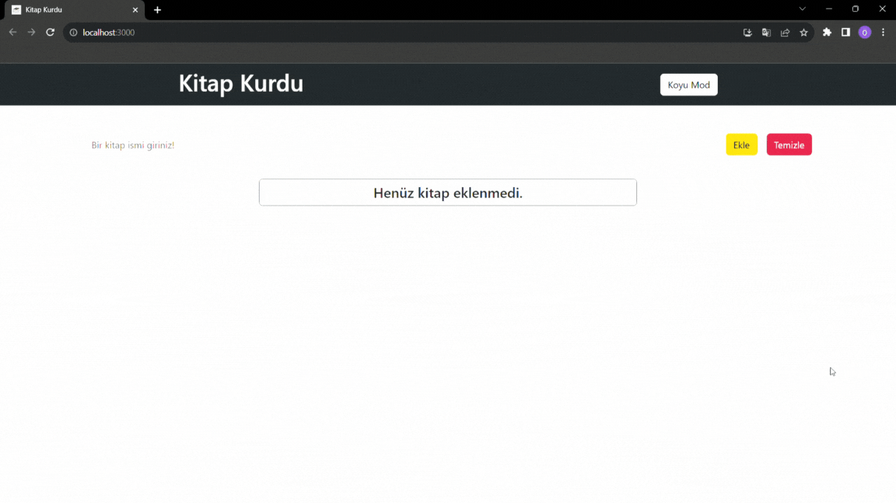

# Crud App

### Özellikler

- Bu proje React kullanılarak tasarlandı.

- Kullanıcının girdiği kitap isimlerini ekrana ekleriz.

- Kitap ismini değiştirmek isterse düzenle butonu ile ismini düzenleyebilir.

- Okuduğu kitapları işaretleyebilir.

- Gerekli olmayan kitapları silebilir.

- Açık ve koyu moddan birinie seçerek kullanabilir.

- <a href="">Canlı Önizleme</a>

### Kullanılan Teknolojiler

- React

- JavaScript

- HTML

- CSS

- Bootstrap

### Gif

